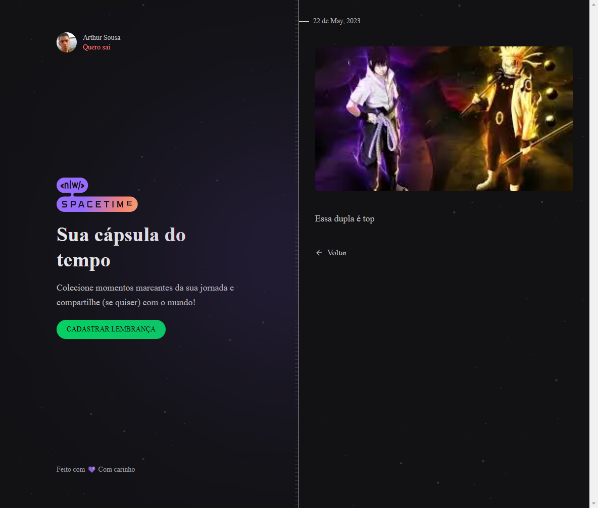

# Spacetime

> Autenticação com github.

# Resumo da aplicação 
Uma cápsula do tempo é um objeto que guarda lembranças e informações relevantes de uma determinada época, com o objetivo de ser aberto e revelado no futuro. Essa prática fascinante permite que as pessoas compartilhem a sua cultura, modo de vida e perspectivas com as gerações futuras.

## 👨‍💻Tecnologia Back End
- Fastify 
- Prisma
- Zod
- dayjs    

## 👨‍💻Tecnologia Front End
 - Tailwindcss
 - Axios 
 - Nextjs com typescript
 - dayjs 

## Instalação da Tecnologia Front End
 - npm i axios 
 - npm install -D tailwindcss postcss autoprefixer
 - radix
 - npm i dayjs  
 - npm i clx 
 - npm create vite@latest
 
## Instalação da Tecnologia Back End
 - nodejs typescript
 - npm i fastify 
 - npm i prisma -D 
 - npm i @fastify/cors
 - npm i prisma-erd-generator @mermaid-js/mermaid-cli -D
 - npm i @prisma/client
 - npx prisma generate
 - npx prisma init --datasource-provider SQLite
 - npm i zod
 - npx prisma studio 

 💛 arthursousarabelo2@gmail.com